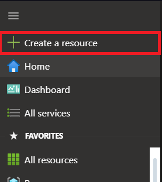
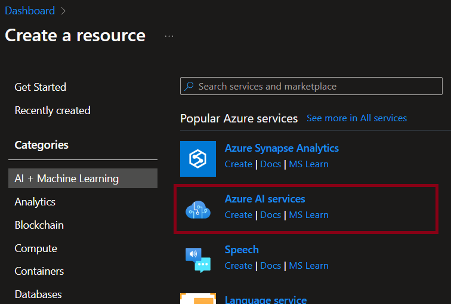
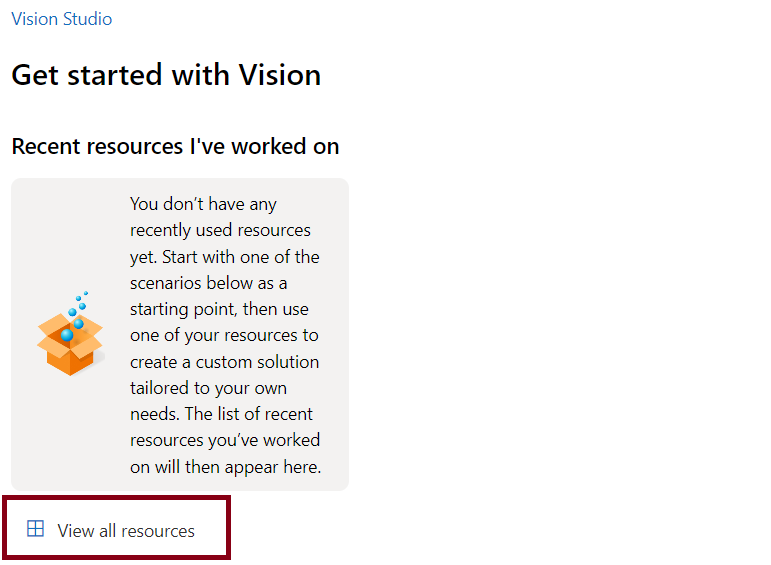
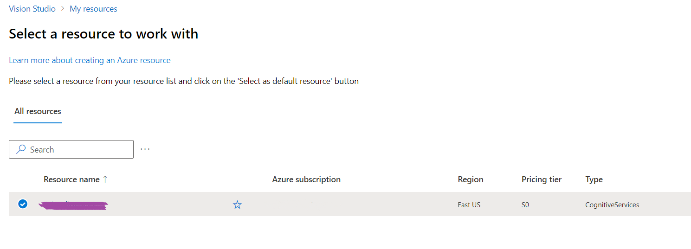
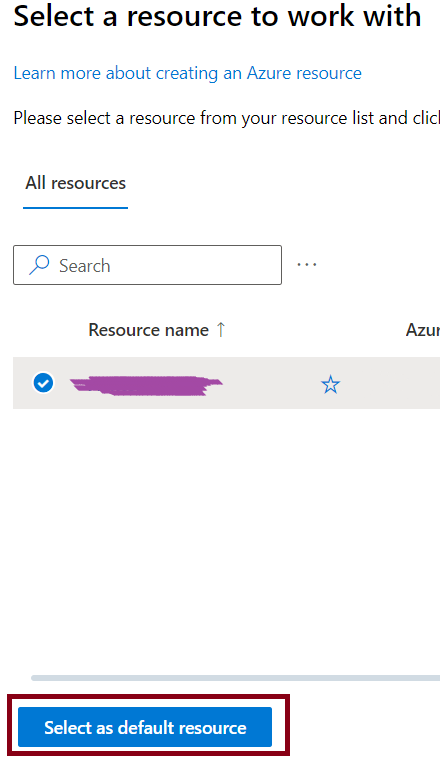
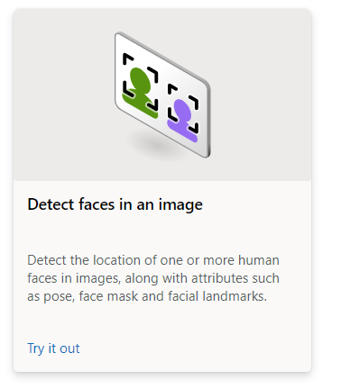
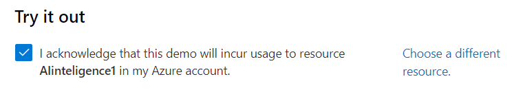
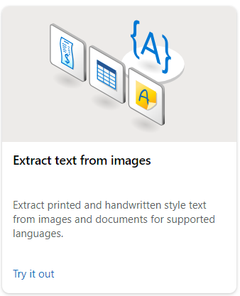
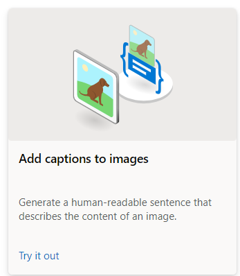

# DIO Challenge — Facial recognition and transforming images into data in Azure ML

## Step by Step: 
### Creating an Azure AI Services Resource:
Before starting the project, it's needed to create an Azure AI services resource as the following steps:
1. Open the Azure portal at https://portal.azure.com;
2. Click the _Create Resource_ button 

    

    and search for **Azure AI Services**
    select create an Azure AI services plan and configure it with the following settings:
    
    ***Subscription**: Your subscription; 
    
    ***Resource group**: Select or create a resource group with a unique name;
    
    ***Region**: East US;
    
    ***Name**: Unique name; 
    
    ***Pricing tier**: Standard S0;
    
    ***By checking this box I acknowledge..** (Selected)

3. Select _Review + create_ then **Create** and wait for deployment to complete.

#### _Connect your Azure AI service resource to Vision Studio_
1. Go to the following website https://portal.vision.cognitive.azure.com;
2. Sign in with your account and making sure you are using the same directory as the one where you created the Azure AI services resource;
3. On the Vision Studio home page, select _View all Resources_:
    
4. On the _Select a resource to work with_ page, click on the resource we created earlier

then, **Select as default resource**

5. Close the settings page and it's done.

### _The Challenges_:
### 1. Detecting faces in the Vision Studio:
1. In the Vision Studio, search for the following tile:

Select the tile and acknowledge the resource usage policy by reading and checking the box

2. Now, you can select each sample image and observe the face detection data that is returned or choose a image from your computer to test it, even use your webcam to see how it works.

The images I used to do this challenge it's in the folder named as 1° Challenge inside the Input directory, just as their results inside the output directory.

### 2. Extract text from images:
1. Search for the tile: 

Click on it, select the checking box and start to test the resource, you can use the samples or select your images.

The images and results that I used it's in the directory as the first challenge.

### 3. Generate captions for an Image:
1. Search for the following tile:
 
and click on it, select the checking box once again and test the resource with your images or the sample images.

My results can be found in the output directory, this time I used the previous images from the other challenges.

### Finalizing:
If you have already finished all the exercises above, delete any resources that you no longer need. This will avoid unnecessary costs for you:

1. Open the Azure Portal at https://portal.azure.com, select the resource group that contains the resource you created
2. Select the resource and select **Delete** and then **_Yes_** to confirm.
